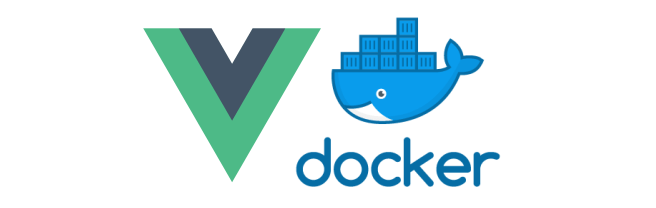

# Conclusión

Sin duda, el tema de la contenerización es muy extenso y solo hemos cubierto una pequeña parte, pero hemos cubierto la base necesaria para empezar. 

>Estaremos encantados si este artículo se convierte en un punto de partida para el desarrollo _**FrontEnd**_ (con Vue) en _**Docker**_.

