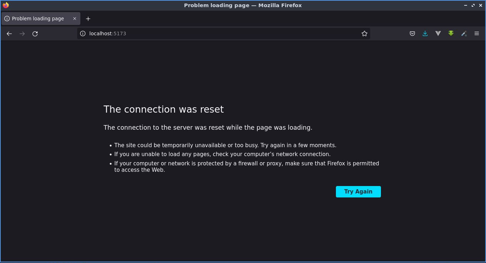
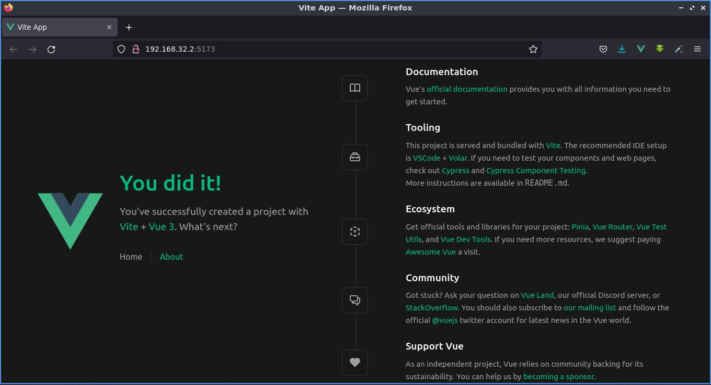

# Modo Desarrollo

>Asumiendo que ya tenemos lista la instalación de un proyecto Vue, como mencionamos en le sección anterior, vamos a preparar nuestro entorno de desarrollo.

Echemos un vistazo a la siguiente plantilla.

📃`docker-compose.dev.yml`
```sh
version: "3.9"
services:
  web:    
    image: node
    ports:
      - "5173:80"
    volumes:
      - ".:/app"
    environment:
      NODE_ENV: development
    working_dir: /app
    container_name: vue_dev_env
    command: sh -c "cd /app; npm install; npm run dev"
```

Tenga en cuenta lo siguiente:

1. Declaramos el servicio `web`.
    - Seleccione la imagen que se compilará, en este caso `node`. **Es mejor detallar las versiones utilizadas**, vale la pena mantenerlas exactamente igual que la compilación de producción. (Ejemplo: `image: node:16.10-alpine3`).
2. Seleccionamos los puertos que reflejarán los puertos del contenedor en ejecución en nuestro sistema `host`.
3. Montamos todo, desde el directorio actual hasta el contenedor. Esto es necesario para que los cambios locales llamen inmediatamente a reconstruir.
4. `environment` le permite establecer variables de entorno que sean de interés en su caso particular.
5. `working_dir` especifica el directorio de trabajo dentro del contenedor en el que se ejecutarán los comandos posteriores.
6. `container_name` permite específicar el nombre del contenedor.
7. `command` ejecuta comandos, en este caso, instalar dependencias y correr el desarrollo.

**Levante el `modo development` con el comando:**

```sh
docker-compose -f docker-compose.dev.yml up
```

Entonces el terminal arrojará los siguientes mensajes:

```
Starting vue_dev_env ... done
Attaching to vue_dev_env
vue_dev_env | 
vue_dev_env | up to date, audited 203 packages in 863ms
vue_dev_env | 
vue_dev_env | 43 packages are looking for funding
vue_dev_env |   run `npm fund` for details
vue_dev_env | 
vue_dev_env | found 0 vulnerabilities
vue_dev_env | 
vue_dev_env | > frontend-code@0.0.0 dev
vue_dev_env | > vite
vue_dev_env | 
vue_dev_env | 
vue_dev_env |   VITE v3.0.9  ready in 361 ms
vue_dev_env | 
vue_dev_env |   ➜  Local:   http://localhost:5173/
vue_dev_env |   ➜  Network: use --host to expose
```

El contenedor levantó, pero si intentáramos abrir el navegador con la ruta `http://localhost:5173/` nos aparecerá la siguiente imagen.



Realmente la aplicación no se ejecuta en nuestra dirección anfitriona `localhost` o `172.0.0.1`, sino en alguna otra dirección **IP** otorgada por _Docker_. Pero Vite aún no lo sabe.

Tomando en cuenta la última línea del mensaje que arroja el terminal, `Network: use --host to expose`, esto significa que no hay una dirección **IP** para la red ya que en ningún momento hemos [declarado el `host` a Vite](https://vitejs.dev/config/server-options.html).

Así que modifiquemos el archivo de configuración de Vite agregando las siguiente líneas.

📃`vite.config.ts`
```ts{8,9,10}
import { fileURLToPath, URL } from 'node:url'

import { defineConfig } from 'vite'
import vue from '@vitejs/plugin-vue'

// https://vitejs.dev/config/
export default defineConfig({
  server: { 
    host: '0.0.0.0'
  }, 
  plugins: [vue()],
  resolve: {
    alias: {
      '@': fileURLToPath(new URL('./src', import.meta.url))
    }
  }
})
```

Luego, volvamos a ejecutar `docker-compose -f docker-compose.dev.yml up` y ahora sí se mostrará alguna nueva **IP** del contenedor.

```sh
vue_dev_env |   ➜  Local:   http://localhost:5173/
vue_dev_env |   ➜  Network: http://192.168.32.2:5173/
```

Por lo que con esta **IP** ahora si debería levantar la aplicación en el navegador.


