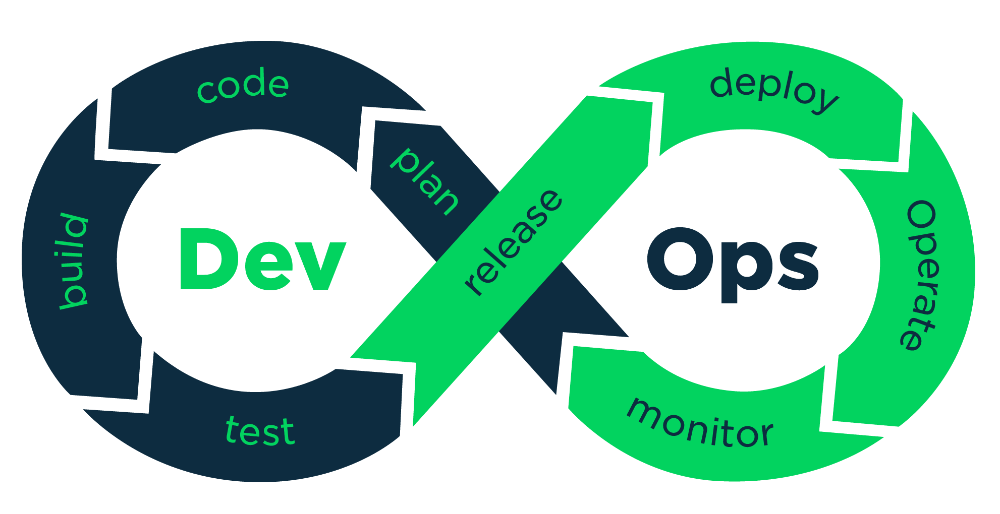
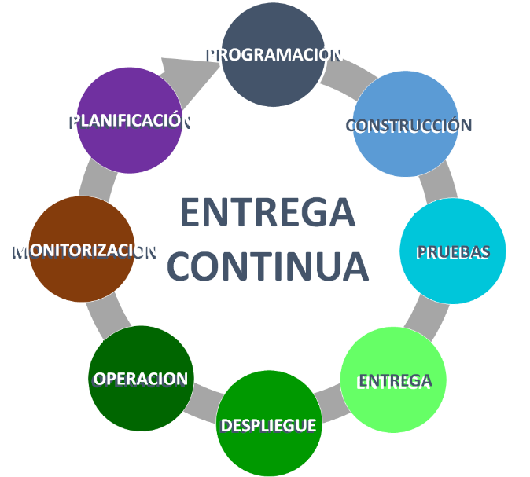

# Introducción

## Fuente de origen

Esta guía es una adaptación de un excelente artículo ejemplificado en [React](https://en.reactjs.org/) y publicado bajo el título [Docker for frontend developers](https://levelup.gitconnected.com/docker-for-frontend-developers-4eeaedf10dc7). Por lo tanto, se puede adaptar a cualquier proyecto frontend; traducido y adaptado por [Ernesto Canquiz](https://github.com/ejimenez123). 

>Teniendo presente lo antes mencionado, entonces, vamos a sumergirnos...

## Efectos de DevOps

> Concepto extraido de [este](https://es.vuejs.org/v2/cookbook/dockerize-vuejs-app.html#Efectos-de-DevOps) enlace.

La adopción de la cultura [DevOps](https://www.netapp.com/es/devops-solutions/what-is-devops/), herramientas y practicas ágiles de ingeniería tienen, por sobre todas las cosas, el lindo efecto de incrementar la colaboración entre los roles de desarrollo y operaciones.

Uno de los principales problemas del pasado (pero también hoy en día en algunas realidades) es que el equipo de desarrollo no estaba interesado en la operación y el mantenimiento de un sistema una vez que se entregó al equipo de operaciones, mientras que este último no estaba realmente consciente de los objetivos de negocio, y por lo tanto, reacios a satisfacer las necesidades operativas del sistema (también denominados “caprichos de los desarrolladores”).

>Por lo tanto, entregar nuestra aplicación Vue.js como una imagen de Docker ayuda a reducir, si no eliminar por completo, la diferencia entre ejecutar el servicio en la computadora portátil de un desarrollador, el entorno de producción o cualquier otro entorno en el que podamos pensar.

## Efectos de entrega continua

>Concepto extraido de [este](https://es.vuejs.org/v2/cookbook/dockerize-vuejs-app.html#Efectos-de-entrega-continua) enlace.

Al aprovechar la disciplina de entrega continua se construye software de tal forma que se puede potencialmente liberar en producción en cualquier momento. Dicha práctica de ingeniería se habilita por medio de lo que normalmente se llama pipeline de entrega continua. El propósito del pipeline de entrega continua es dividir nuestra construcción en etapas (por ejemplo, compilación, pruebas unitarias, pruebas de integración, pruebas de rendimiento, etc.) y dejar que cada etapa verifique nuestro artefacto de compilación cada vez que cambie nuestro software. En última instancia, cada etapa aumenta nuestra confianza de que tan lista para producción se encuentra nuestra compilación y, por lo tanto, reduce el riesgo de romper cosas en producción (o cualquier otro entorno).

>Por lo tanto, crear una imagen de Docker para nuestra aplicación Vue.js es una buena opción aquí porque representaría nuestro artefacto de construcción final, el mismo artefacto que se verificará contra nuestra entrega continua y que potencialmente podría liberarse a producción con confianza.

