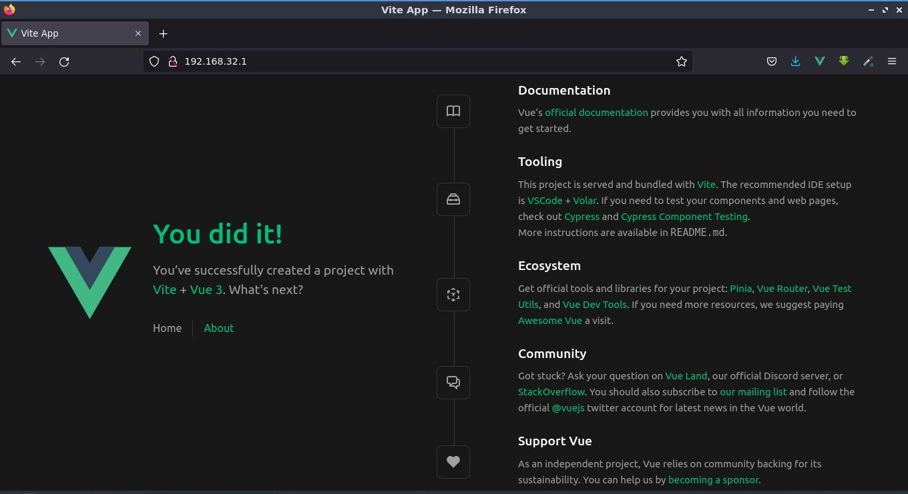

# Modo Producción

>**¿Cuál es la diferecia en esta configuración versus la versión de desarrollo?**

## docker-compose.yml

📃`docker-compose.yml`
```sh
version: "3.9"
services:
  web:
    build:
      context: .
      dockerfile: Dockerfile
    ports:
      - "80:80"
    environment:
      NODE_ENV: production
    container_name: vue_dev_env
```
- Compilación especificada desde `Dockerfile` en lugar de usar una `image`.
- La variable de entorno `NODE_ENV` cambió: `development` -> `production`.
- No hay una sección de comandos porque `nginx` servirá la estática.

La configuración de `nginx` es lo más simple posible y no sobrecarga el proceso de entrega de archivos y recurre a `/index.html` en caso de que intenten obtener algún archivo que no esté allí. Lo más interesante radica en el `Dockerfile`: construcción de varias etapas (_multi-stage_), que se utiliza para reducir el artefacto resultante.

## Dockerfile
📃`Dockerfile`
```sh
FROM node:18.8.0 AS build
WORKDIR /app
COPY package.json package.json
RUN npm install
COPY . .
RUN npm run build

FROM nginx:1.23.1
COPY --from=build /app/dist /opt/site
COPY nginx.conf /etc/nginx/nginx.conf
```

**La primera etapa es `build`.**

1. Para ello, especificamos la misma imagen de origen que se utilizó para desarrollar. `FROM node:18.8.0 AS build`. ¡Importante! Le damos a la etapa el nombre `build` para que en las siguientes etapas se llame por su nombre, y no por su índice, que puede cambiar si incluimos etapas adicionales.
2. Especifique el `WORKDIR /app`.
3. **Pregunta**: ¿por qué primero copiamos solo `package.json` y lo instalamos? La **respuesta** (no se hace esperar mucho): la primera vez que ejecute la diferencia no se notará, pero la diferencia será obvia en el próximo intento de compilación. Si no hubo cambios en `package.json`, las capas sobre las que se construye _**docker**_ no cambiarán, y estos pasos simplemente se tomarán del _**caché**_. Esto acelerará enormemente el proceso y reducirá varias veces la carga de la red. Solo necesitamos esto.
4. Copiar los archivos restantes y ejecutar la construcción.

**La segunda etapa es la formación de un artefacto.**

En esencia, un artefacto en nuestro caso es un contenedor `nginx` con estática.

5. Especificamos la imagen `FROM nginx:1.23.1` que tomaremos como base.
6. Copiamos los archivos desde la primera etapa a la carpeta a la que distribuiremos las estáticas.
7. Copiamos el archivo de configuración de `nginx` en el artefacto.

## nginx.conf

Las opciones de configuración de NGINX se conocen como _“directivas”_: estas se organizan en grupos, conocidos indistintamente como bloques o contextos. Copie y pegue este archivo en la raiz del proyecto.

📃`nginx.conf`
```sh
worker_processes auto;

events {
    worker_connections 8000;
    multi_accept on;
}

http {
  include       /etc/nginx/mime.types;
  default_type  application/octet-stream;

  server {
      listen   80;
      listen   [::]:80 default ipv6only=on;

      root /opt/site;

      location / {
          try_files $uri $uri/ /index.html;
      }
  }
}
```
## Build Up

Ahora puede ejecutar el artefacto de esta manera:

```sh
docker-compose up -d --build
```

Docker comenzará con el proceso de instación y finalizará con un mensaje como el siguiente:

```sh
Successfully built 5103e27c5863
Successfully tagged docker-vue-example_web:latest
Recreating vue_dev_env ... done
```

Inspeccionemos la dirección **IP** otorgada por _Docker_ a nuestro contenedor `vue_dev_env` con el siguiente comando.

```sh
docker inspect vue_dev_env
```

Y deberá aparecer al final un mensaje como este:

```sh
          "NetworkID": "04608c48ec451acd128c224efa450d0334a7d0cccc3b14c2ec760b1d2c8bc4dc",
          "EndpointID": "32e900e38758c907bc25212e984944494957de446f5644c7799bc74c51696b9d",
          "Gateway": "192.168.32.1",
          "IPAddress": "192.168.32.2",
          "IPPrefixLen": 20,
          "IPv6Gateway": "",
          "GlobalIPv6Address": "",
          "GlobalIPv6PrefixLen": 0,
          "MacAddress": "02:42:c0:a8:20:02",
          "DriverOpts": null
        }
      }
    }
  }
]
```

Ok, ahora copie y pegue tal cual la dirección **IP** en la **URL** del navegador.



